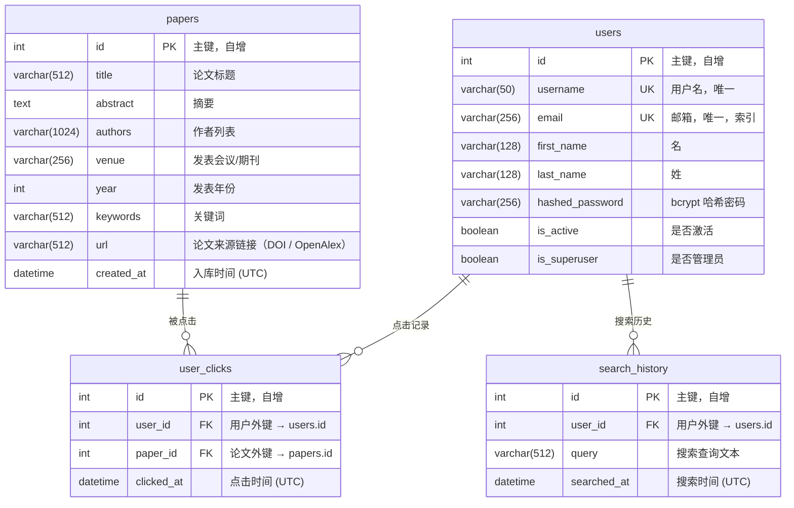

# Academic Paper Search & Recommend System

基于 **Vue 3 + FastAPI + MySQL + ChromaDB + Qwen** 的学术论文语义搜索与个性化推荐系统。

系统融合向量语义检索、基于 Embedding 质心的协同过滤推荐、可选 Reranker 精排、以及大语言模型驱动的学术问答，为用户提供一站式学术论文发现与交互体验。

---

## 目录

- [系统架构](#系统架构)
- [技术栈](#技术栈)
- [数据库设计](#数据库设计)
- [核心算法](#核心算法)
- [实现功能](#实现功能)
- [实验结果](#实验结果)
- [环境配置与启动](#环境配置与启动)
- [项目结构](#项目结构)

---

## 系统架构

系统采用**三层微服务架构**：前端展示层、业务后端层、算法服务层，各层职责分离，通过 HTTP/SSE 协议通信。

```
┌─────────────────────────────────────────────────────────────┐
│                     用户浏览器 (Browser)                      │
│                   Vue 3 + Element Plus + Vite                │
│                         :5173                                │
└──────────────────────────┬──────────────────────────────────┘
                           │ /api/* Proxy (Vite Dev Server)
                           ▼
┌─────────────────────────────────────────────────────────────┐
│                  业务层 Backend (FastAPI)                     │
│                         :8000                                │
│  ┌──────────┐ ┌──────────┐ ┌───────────┐ ┌──────────────┐  │
│  │ 用户认证  │ │ 论文 CRUD │ │ 搜索/推荐  │ │ 聊天转发(SSE)│  │
│  │ JWT/OAuth2│ │          │ │ 降级兜底   │ │              │  │
│  └──────────┘ └──────────┘ └─────┬─────┘ └──────┬───────┘  │
│       │                          │               │           │
│       ▼                          │               │           │
│  ┌──────────┐                    │               │           │
│  │  MySQL   │                    │               │           │
│  │  8.0+    │                    │               │           │
│  └──────────┘                    │               │           │
└──────────────────────────────────┼───────────────┼──────────┘
                                   │ HTTP          │ HTTP (SSE)
                                   ▼               ▼
┌─────────────────────────────────────────────────────────────┐
│                算法层 Backend_Algo (FastAPI)                  │
│                         :8003                                │
│  ┌──────────────┐  ┌────────────┐  ┌─────────────────────┐  │
│  │ 向量语义检索  │  │ 质心推荐    │  │ LLM 对话 (流式/非流式)│  │
│  │ ChromaDB     │  │ Embedding  │  │ Qwen Compatible API │  │
│  │ + Reranker   │  │ Centroid   │  │                     │  │
│  └──────┬───────┘  └─────┬──────┘  └──────────┬──────────┘  │
└─────────┼────────────────┼─────────────────────┼────────────┘
          │                │                     │
          ▼                ▼                     ▼
   ┌────────────┐   ┌────────────┐        ┌──────────────┐
   │  ChromaDB  │   │ DashScope  │        │ DashScope /  │
   │ 向量数据库  │   │ text-embed │        │ Qwen Chat    │
   │ (persistent)│   │    -v4     │        │ compatible   │
   └────────────┘   └────────────┘        └──────────────┘
```

### 数据流说明

1. **搜索流程**: 用户输入查询 → Backend 记录搜索历史 → 转发到 Algo 层 → 查询向量化 → ChromaDB ANN 检索 → 可选 Reranker 精排 → 返回 paper_id + score → Backend 从 MySQL 补全元数据 → 返回前端
2. **推荐流程**: 用户浏览论文时记录点击 → 请求推荐时获取点击历史 → Algo 层获取已读论文 Embedding → 计算质心向量 → ChromaDB 近邻搜索 → 过滤已读 → 返回推荐列表
3. **对话流程**: 前端发送多轮对话 → Backend 注入用户近期阅读论文作为系统提示词 → 转发到 Algo 层 → Qwen OpenAI 兼容接口流式生成 → SSE 实时返回前端
4. **降级机制**: 算法层不可用时，搜索自动降级为 MySQL `LIKE` 模糊匹配

---

## 技术栈

| 层级 | 技术 | 版本 | 说明 |
|------|------|------|------|
| **前端** | Vue 3 | 3.4.21 | Composition API + `<script setup>` |
| | Element Plus | 2.6.3 | UI 组件库 |
| | Pinia | 2.1.7 | 状态管理 (JWT Token 持久化) |
| | Axios | 1.6.8 | HTTP 客户端 |
| | Marked | 18.0.3 | Markdown 渲染 (LLM 对话) |
| | Vite | 5.1.6 | 构建工具 + 开发代理 |
| **业务层** | FastAPI | 0.114.0 | 异步 Web 框架 |
| | SQLAlchemy | 2.0.35 | ORM |
| | PyMySQL | - | MySQL 驱动 |
| | PyJWT | 2.8.0 | JWT Token 编解码 |
| | Passlib + bcrypt | - | 密码哈希 |
| **算法层** | FastAPI | 0.114.0 | 独立微服务 |
| | ChromaDB | - | 向量数据库 |
| | NumPy | - | 数值计算 (质心/余弦相似度) |
| | OpenAI SDK | - | DashScope / OpenAI 兼容客户端 |
| **模型** | qwen-flash / qwen-plus | - | 对话模型 |
| | text-embedding-v4 | 1024 维 | 论文语义向量化 |
| | qwen3-rerank | - | 可选精排模型 |
| **存储** | MySQL 8.0+ | - | 结构化数据 (用户、论文、行为) |
| | ChromaDB | - | 向量索引 (Embedding 持久化存储) |

---

## 数据库设计

### ER 图



### 表结构说明

#### 1. `users` — 用户表

| 字段 | 类型 | 约束 | 说明 |
|------|------|------|------|
| `id` | INT | PK, AUTO_INCREMENT | 主键 |
| `username` | VARCHAR(50) | UNIQUE, NOT NULL | 登录用户名 |
| `email` | VARCHAR(256) | UNIQUE, INDEX | 邮箱地址 |
| `first_name` | VARCHAR(128) | | 名 |
| `last_name` | VARCHAR(128) | | 姓 |
| `hashed_password` | VARCHAR(256) | | bcrypt 加密后的密码 |
| `is_active` | BOOLEAN | DEFAULT TRUE | 账户是否激活 |
| `is_superuser` | BOOLEAN | DEFAULT FALSE | 是否为超级管理员 |

#### 2. `papers` — 论文表

| 字段 | 类型 | 约束 | 说明 |
|------|------|------|------|
| `id` | INT | PK, AUTO_INCREMENT | 主键 |
| `title` | VARCHAR(512) | | 论文标题 |
| `abstract` | TEXT | | 论文摘要 |
| `authors` | VARCHAR(1024) | | 作者列表 (逗号分隔) |
| `venue` | VARCHAR(256) | | 发表会议/期刊 (如 VLDB, SIGMOD) |
| `year` | INT | | 发表年份 |
| `keywords` | VARCHAR(512) | | 关键词 (逗号分隔) |
| `url` | VARCHAR(512) | | 论文来源链接（DOI / 出版方 / OpenAlex） |
| `created_at` | DATETIME | DEFAULT UTC_NOW | 记录创建时间 |

#### 3. `user_clicks` — 用户点击记录表

| 字段 | 类型 | 约束 | 说明 |
|------|------|------|------|
| `id` | INT | PK, AUTO_INCREMENT | 主键 |
| `user_id` | INT | FK → users.id | 点击用户 |
| `paper_id` | INT | FK → papers.id | 被点击论文 |
| `clicked_at` | DATETIME | DEFAULT UTC_NOW | 点击时间戳 |

#### 4. `search_history` — 搜索历史表

| 字段 | 类型 | 约束 | 说明 |
|------|------|------|------|
| `id` | INT | PK, AUTO_INCREMENT | 主键 |
| `user_id` | INT | FK → users.id | 搜索用户 |
| `query` | VARCHAR(512) | | 搜索查询文本 |
| `searched_at` | DATETIME | DEFAULT UTC_NOW | 搜索时间戳 |

### 关系说明

- `users` 1:N `user_clicks` — 一个用户可有多条点击记录
- `papers` 1:N `user_clicks` — 一篇论文可被多个用户点击
- `users` 1:N `search_history` — 一个用户可有多条搜索历史
- `user_clicks` 构成 `users` 与 `papers` 之间的**多对多关系**（附带时间戳的关联表）

---

## 核心算法

### 1. 向量语义检索 (Semantic Search)

采用 **Dense Retrieval** 范式，将自然语言查询和论文内容映射到同一向量空间，通过向量距离度量语义相关性。

#### 索引构建

```
输入: 论文集合 P = {p₁, p₂, ..., pₙ}
对每篇论文 pᵢ:
    docᵢ = concat(pᵢ.title, ". ", pᵢ.abstract, ". ", pᵢ.keywords)
    embᵢ = text-embedding-v4(docᵢ)  ∈ ℝ¹⁰²⁴
    ChromaDB.upsert(id=pᵢ.id, embedding=embᵢ)
```

#### 检索流程

```
输入: 查询文本 q, 返回数量 k
1. q_emb = text-embedding-v4(q)              # 查询向量化
2. results = ChromaDB.query(q_emb, n=k)      # ANN 近邻搜索
3. 对每个结果 rᵢ:
     scoreᵢ = 1 / (1 + distanceᵢ)           # 欧氏距离 → 相关性分数
4. 返回按 score 降序排列的结果
```

#### 降级策略

当算法层不可用时，自动降级为 SQL 模糊搜索:

```sql
SELECT * FROM papers
WHERE title LIKE '%keyword%'
   OR abstract LIKE '%keyword%'
   OR keywords LIKE '%keyword%'
   OR authors LIKE '%keyword%'
LIMIT page_size OFFSET skip;
```

### 2. 基于 Embedding 质心的个性化推荐 (Centroid-based Recommendation)

利用用户历史点击行为构建兴趣画像，通过计算已点击论文 Embedding 的质心向量，在向量空间中寻找最近邻的未读论文作为推荐结果。本质上是一种**基于内容的协同过滤**方法。

```
输入: 用户 u 的点击历史 C = {c₁, c₂, ..., cₘ} (最近 50 篇), 推荐数量 k

1. 获取 Embedding:
   E = {emb(c₁), emb(c₂), ..., emb(cₘ)}     # 从 ChromaDB 获取已点击论文的向量

2. 计算兴趣质心:
   centroid = (1/m) · Σᵢ₌₁ᵐ emb(cᵢ)         # 所有点击论文 Embedding 的均值

3. 近邻搜索:
   candidates = ChromaDB.query(
       query_embeddings=[centroid],
       n_results=k + |C|                       # 多取一些以补偿过滤
   )

4. 过滤已读:
   results = [p for p in candidates if p.id ∉ C]

5. 返回 results[:k]                           # 截取 top-k
```

| 特性 | 说明 |
|------|------|
| **冷启动** | 无点击记录时返回空列表（可扩展为热门推荐） |
| **实时性** | 每次请求实时计算，无需离线训练 |
| **可解释性** | 质心方向代表用户综合兴趣 |
| **时间窗口** | 取最近 50 条点击，反映近期兴趣 |

### 3. Reranker 精排

对初步检索结果进行二次排序，提高排序精度。系统提供三种 Reranker 方案：

| 方案 | 实现方式 | 说明 |
|------|---------|------|
| `none` | 不重排 | 直接使用 ChromaDB 返回的距离得分 |
| `cosine` | 余弦相似度重排 | 本地计算 query 与文档 Embedding 的余弦相似度 |
| `qwen` | Qwen3-Rerank API | 调用 DashScope 文本精排服务，效果最优 |

#### 余弦相似度重排算法

```
输入: 查询 q, 候选文档集 D = {d₁, d₂, ..., dₙ}, 返回数量 top_n

1. 向量化:
   all_emb = text-embedding-v4([q, d₁, d₂, ..., dₙ])
   q_emb = all_emb[0],  doc_embs = all_emb[1:]

2. 余弦相似度计算:
   q̂ = q_emb / ‖q_emb‖
   d̂ᵢ = doc_embsᵢ / ‖doc_embsᵢ‖
   scoreᵢ = d̂ᵢ · q̂                            # 点积 = 余弦相似度 (已归一化)

3. 按 score 降序排列，返回前 top_n 个
```

### 4. LLM 学术问答 (Qwen Chat)

```
用户阅读论文 → Backend 获取最近 5 篇已读论文
                ↓
系统提示词 (System Prompt) ← 注入论文上下文
                ↓
用户多轮对话历史 [msg₁, msg₂, ..., msgₙ]
                ↓
DashScope / OpenAI Compatible API (qwen-flash)
                ↓
流式 SSE 响应 → 前端实时渲染 Markdown
```

- 前端使用 `fetch` + `ReadableStream` 读取 SSE
- 后端使用 FastAPI `StreamingResponse` 透传 Server-Sent Events
- 支持多轮对话上下文保持，对话历史持久化到 localStorage

---

## 实现功能

### API 接口

#### 认证相关

| 端点 | 方法 | 认证 | 说明 |
|------|------|------|------|
| `/token` | POST | 否 | 用户登录，返回 JWT Token |
| `/users/me/` | GET | 是 | 获取当前用户信息 |
| `/users/` | POST | 否 | 用户注册 |
| `/users/` | GET | 是 | 获取用户列表 (分页) |
| `/users/{user_id}` | GET | 是 | 按 ID 获取用户 |
| `/users/name/{username}` | GET | 是 | 按用户名获取用户 |

#### 论文管理

| 端点 | 方法 | 认证 | 说明 |
|------|------|------|------|
| `/papers/` | GET | 是 | 论文列表 (分页: `skip`, `limit`) |
| `/papers/{paper_id}` | GET | 是 | 论文详情 |
| `/papers/bulk` | POST | 是 | 批量创建论文 |

#### 搜索与推荐

| 端点 | 方法 | 认证 | 请求体 | 说明 |
|------|------|------|--------|------|
| `/search` | POST | 是 | `{query, page, page_size, use_rerank, rerank_provider}` | 语义搜索 + 降级关键词搜索 |
| `/click` | POST | 是 | `{paper_id}` | 记录论文点击行为 |
| `/recommend` | GET | 是 | - | 基于点击历史的个性化推荐 |
| `/search/history` | GET | 是 | - | 获取当前用户的搜索历史 |

#### AI 对话

| 端点 | 方法 | 认证 | 请求体 | 说明 |
|------|------|------|--------|------|
| `/chat` | POST | 是 | `{prompt}` | 非流式 LLM 对话 |
| `/chat/stream` | POST | 是 | `{messages: [{role, content}]}` | 流式 SSE 对话 (支持多轮) |

认证方式: OAuth2 Bearer Token (`Authorization: Bearer <jwt_token>`)，Token 有效期 30 分钟，签名算法 HS256。

### 前端页面

| 页面 | 组件 | 功能 |
|------|------|------|
| 登录 | `LoginForm.vue` | 用户名密码登录，JWT 持久化到 localStorage |
| 注册 | `RegisterForm.vue` | 新用户注册 (用户名、邮箱、姓名) |
| 论文搜索 | `PaperSearch.vue` | 语义搜索 + 搜索历史标签 + Rerank 开关 + 分页表格 |
| 论文详情 | `PaperDetail.vue` | 标题、作者、摘要、关键词、论文来源链接跳转 |
| 论文推荐 | `PaperRecommend.vue` | 基于浏览历史的个性化推荐列表 |
| AI 对话 | `Chat.vue` | 流式 Markdown 渲染 + 多轮对话 + 启动提示 |
| 用户管理 | `Profile.vue`, `CheckUserInfo.vue`, `AddUser.vue` | 个人信息、用户列表、添加用户 |

### 前端特性

- **路由守卫**: 未登录用户自动重定向至登录页
- **Token 持久化**: JWT 存储在 localStorage，页面刷新自动恢复登录状态
- **流式渲染**: LLM 回复使用 SSE + `marked` 实时渲染 Markdown（支持代码高亮、表格、列表）
- **搜索历史**: 去重后以标签形式展示，点击可快速复搜
- **Rerank 开关**: 搜索页面可一键切换是否启用精排，选项持久化到 localStorage
- **分页查询**: 搜索结果支持分页浏览

---

## 实验结果

系统包含 8 组完整的算法分析实验，位于 `experiments/` 目录。实验基于 120 篇来自 OpenAlex 的真实数据库/数据管理方向论文，使用 `text-embedding-v4` (1024 维) 作为 Embedding 模型，每组实验重复 3 次取均值。

Ground Truth 基于 8 个主题类别（query optimization、SQL indexing、distributed database、transaction processing、graph database、cloud database、security/privacy、retrieval/indexing）构建了 20 条搜索查询及其相关论文标注。

### 实验一：搜索系统消融实验

逐一替换或移除系统组件，评估各组件对整体搜索效果的贡献。

| 编号 | 配置 | P@5 | P@10 | P@20 | NDCG@5 | NDCG@10 | MRR | 延迟 (ms) |
|------|------|-----|------|------|--------|---------|-----|----------|
| A1 | **完整系统** (向量检索 + Rerank) | 0.900 | 0.858 | 0.696 | 0.919 | 0.884 | 0.979 | 411.4 |
| A2 | SQL LIKE 关键词搜索 | 0.600 | 0.563 | 0.444 | 0.621 | 0.587 | 0.805 | 7.9 |
| A3 | TF-IDF 余弦相似度 | 0.883 | 0.758 | 0.606 | 0.908 | 0.813 | 1.000 | 0.5 |
| A4 | 向量检索 (无 Rerank) | 0.900 | 0.858 | 0.696 | 0.919 | 0.884 | 0.979 | 213.9 |
| A5 | 向量检索 (余弦距离) | 0.900 | 0.858 | 0.696 | 0.919 | 0.884 | 0.979 | 198.3 |

**分析**: 向量语义检索 (A1/A4/A5) 在 P@K 和 NDCG@K 上显著优于 SQL LIKE (A2)，提升幅度约 30-50%。TF-IDF (A3) 效果接近但在 P@10、P@20 上弱于向量检索，说明预训练语言模型 Embedding 在语义理解上有明显优势。

### 实验二：推荐系统消融实验

评估推荐算法各组件的贡献。

| 编号 | 配置 | Hit Rate@10 | Coverage | Diversity | 延迟 (ms) |
|------|------|-------------|----------|-----------|----------|
| B1 | **完整质心推荐** | 0.750 | 0.608 | 0.489 | 12.4 |
| B2 | 仅最后一次点击推荐 | 0.708 | 0.742 | 0.513 | 13.4 |
| B3 | 缩短窗口 (仅 5 篇历史) | 0.750 | 0.608 | 0.489 | 10.3 |
| B4 | 不过滤已读论文 | 0.583 | 0.683 | 0.482 | 10.7 |
| B5 | 质心加随机扰动 | 0.833 | 0.742 | 0.534 | 11.5 |

**分析**: 过滤已读 (B1 vs B4) 对 Hit Rate 贡献显著 (+16.7%)。质心聚合 vs 单篇近邻 (B1 vs B2) 在 Hit Rate 上略有优势。随机扰动 (B5) 意外提升了命中率和多样性，说明在小数据集上引入适度随机性有利于探索。

### 实验三：搜索系统性能评估

完整检索 pipeline 的多维度评估 (3 次重复运行)。

| 指标 | 均值 | 标准差 |
|------|------|--------|
| P@5 | 0.900 | 0.000 |
| P@10 | 0.858 | 0.000 |
| P@20 | 0.696 | 0.000 |
| R@5 | 0.180 | 0.000 |
| R@10 | 0.339 | 0.000 |
| R@20 | 0.522 | 0.000 |
| NDCG@5 | 0.919 | 0.000 |
| NDCG@10 | 0.884 | 0.000 |
| NDCG@20 | 0.802 | 0.000 |
| MRR | 0.979 | 0.000 |
| MAP | 0.482 | 0.000 |

**延迟分解:**

| 阶段 | 均值 (ms) | 标准差 (ms) |
|------|-----------|------------|
| Embedding 编码 | 199.6 | 34.1 |
| ChromaDB 检索 | 7.3 | 2.5 |
| Reranker 精排 | 8.6 | 0.4 |
| **端到端总计** | **215.5** | **37.0** |

**分析**: 系统在 P@5 上达到 0.90、MRR 达到 0.979，表明前 5 个结果的质量很高。延迟瓶颈主要在 Embedding 编码阶段 (占总延迟 92.6%)，ChromaDB 向量检索本身仅需 ~7ms。

### 实验四：推荐系统性能评估

| 指标 | 均值 | 标准差 |
|------|------|--------|
| Hit Rate@10 | 0.604 | 0.000 |
| Coverage | 0.608 | 0.000 |
| Diversity | 0.489 | 0.000 |
| Novelty | 6.644 | 0.000 |
| 延迟 (ms) | 11.4 | 0.6 |

**分析**: 推荐延迟极低 (~11ms)，Hit Rate 为 0.60，Coverage 为 0.61 表明推荐涵盖了 61% 的论文库。Novelty 为 6.64 bit，说明系统倾向于推荐相对冷门的论文而非头部热门论文。

### 实验五：距离度量对比

比较 ChromaDB 中不同向量距离度量的检索效果。

| 距离度量 | P@5 | P@10 | NDCG@5 | NDCG@10 | MRR | 检索延迟 (ms) |
|---------|-----|------|--------|---------|-----|-------------|
| L2 欧氏距离 | 0.900 | 0.858 | 0.919 | 0.884 | 0.979 | 6.28 |
| Cosine 余弦 | 0.900 | 0.858 | 0.919 | 0.884 | 0.979 | 5.79 |
| Inner Product 内积 | 0.900 | 0.858 | 0.919 | 0.884 | 0.979 | 6.00 |

**分析**: 在 `text-embedding-v4` 生成的 1024 维归一化向量上，三种距离度量的检索效果完全一致。这是因为对归一化向量而言，L2 距离、余弦相似度和内积在排序上等价。Cosine 度量延迟略低。

### 实验六：文档表示对比

比较不同的论文文本组合方式对向量化和检索效果的影响。

| 编号 | 文档表示 | P@5 | P@10 | NDCG@5 | NDCG@10 | MRR | MAP |
|------|---------|-----|------|--------|---------|-----|-----|
| C1 | 仅 Title | 0.842 | 0.796 | 0.868 | 0.827 | 0.979 | 0.442 |
| C2 | 仅 Abstract | 0.892 | 0.846 | 0.896 | 0.863 | 0.958 | 0.448 |
| C3 | 仅 Keywords | **0.925** | **0.867** | **0.928** | **0.887** | 0.958 | 0.466 |
| C4 | Title + Abstract | 0.892 | 0.846 | 0.904 | 0.869 | 0.958 | 0.461 |
| C5 | **Title + Abstract + Keywords** | 0.900 | 0.858 | 0.919 | 0.884 | **0.979** | **0.482** |

**分析**: 仅关键词 (C3) 在 P@K 上取得最高分，这是因为 Ground Truth 本身按主题关键词构建。完整拼接 (C5) 在 MRR 和 MAP 上最优，综合表现最均衡，是系统的默认配置。

### 实验七：Reranker 对比

评估不同精排策略对检索效果的影响。

| 编号 | Pipeline | P@5 | P@10 | NDCG@5 | NDCG@10 | MAP | 延迟 (ms) |
|------|----------|-----|------|--------|---------|-----|----------|
| R1 | Base Vector (无精排) | 0.900 | 0.858 | 0.919 | 0.884 | 0.482 | 244.6 |
| R2 | Qwen3-Rerank (召回 60) | **0.925** | 0.854 | **0.939** | **0.886** | 0.471 | 569.0 |
| R3 | Qwen3-Rerank (召回 100) | **0.925** | 0.854 | **0.939** | **0.886** | 0.473 | 615.4 |

**分析**: Qwen3-Rerank 在 P@5 和 NDCG@5 上提升了 2.5%，但延迟翻倍 (~570ms vs 245ms)。扩大召回窗口 (R3 vs R2) 效果几乎无差异，说明 60 的召回量已足够。可根据延迟要求选择是否启用精排。

### 实验八：数据规模扩展测试

测试不同论文数量下的索引构建和检索性能。

| 论文数 | 索引构建 (ms) | Embedding (ms) | Upsert (ms) | 平均查询 (ms) | P95 (ms) | 最大 (ms) |
|--------|-------------|----------------|-------------|-------------|----------|----------|
| 20 | 1,405 | 1,271 | 134 | 4.56 | 6.30 | 7.49 |
| 40 | 3,049 | 2,867 | 182 | 4.36 | 6.04 | 7.63 |
| 60 | 3,865 | 3,672 | 193 | 4.37 | 6.41 | 7.85 |
| 80 | 5,444 | 5,168 | 276 | 3.78 | 7.55 | 10.69 |
| 100 | 6,454 | 6,215 | 239 | 3.15 | 4.99 | 6.47 |
| 120 (全量) | 7,802 | 7,576 | 226 | 3.18 | 4.67 | 5.85 |

**分析**: 索引构建时间与论文数量基本呈线性关系，瓶颈在 Embedding 编码（API 调用），ChromaDB upsert 仅占约 3%。查询延迟在 120 篇规模下稳定在 3-6ms，P95 < 5ms，表明 ChromaDB 在千篇级别有良好的可扩展性。

### 运行实验

```bash
cd experiments
pip install -r requirements.txt
python run_all.py                    # 运行实验 1-8
RUN_CONCURRENT=1 python run_all.py   # 包含实验 9 (并发压测)
```

结果以 JSON 格式保存在 `experiments/results/` 目录。

---

## 环境配置与启动

### 前置依赖

- Python 3.10+
- Node.js 18+
- MySQL 8.0+

### 一键启动（推荐）

```bash
bash start_all.sh     # 启动全部服务
bash stop_all.sh      # 停止全部服务
```

> 说明：`start_all.sh` / `stop_all.sh` 负责前端、业务层和算法层；MySQL 需要先确保已经启动。

### 这台机器上的一键启动

当前机器已经准备好了用户态 MySQL，路径固定为：

- MySQL 启动脚本：`/datacenter/ALEX_undergraduate/workspaces/njj20060901/mysql-run/start.sh`
- MySQL 停止脚本：`/datacenter/ALEX_undergraduate/workspaces/njj20060901/mysql-run/stop.sh`
- 项目目录：`/datacenter/ALEX_undergraduate/workspaces/njj20060901/academic/database/mysql_fastapi_vue_project`

推荐直接在项目根目录执行下面这组命令：

```bash
cd /datacenter/ALEX_undergraduate/workspaces/njj20060901/academic/database/mysql_fastapi_vue_project

# 如 8000 / 8003 / 5173 已被旧进程占用，先清掉
for port in 8000 8003 5173; do
  fuser -k -n tcp "$port" 2>/dev/null || true
done

# 启动本机 MySQL
/datacenter/ALEX_undergraduate/workspaces/njj20060901/mysql-run/start.sh

# 启动前端 + 业务层 + 算法层，并监听 0.0.0.0
ALGO_HOST=0.0.0.0 BACKEND_HOST=0.0.0.0 FRONTEND_HOST=0.0.0.0 ./start_all.sh
```

停止命令：

```bash
cd /datacenter/ALEX_undergraduate/workspaces/njj20060901/academic/database/mysql_fastapi_vue_project
./stop_all.sh
/datacenter/ALEX_undergraduate/workspaces/njj20060901/mysql-run/stop.sh
```

启动完成后可访问：

- 前端：`http://127.0.0.1:5173`
- 前端（局域网）：`http://<本机IP>:5173`
- 业务层文档：`http://127.0.0.1:8000/docs`
- 算法层文档：`http://127.0.0.1:8003/docs`

### 新机器从零启动

1. 克隆仓库并安装依赖：

```bash
git clone git@github.com:JunjieNian/paper-search-database.git
cd paper-search-database

python3 -m venv .venv
source .venv/bin/activate

pip install -r backend/requirements.txt
pip install -r backend_algo/requirements.txt
cd frontend && npm install && cd ..
```

2. 复制配置模板并填写：

```bash
cp backend/.env.example backend/.env
cp backend_algo/.env.example backend_algo/.env
cp frontend/.env.development.example frontend/.env.development.local
```

- `backend/.env`：填写 `MYSQL_USER`、`MYSQL_PASSWORD`、`MYSQL_DATABASE`
- `backend_algo/.env`：填写 `DASHSCOPE_API_KEY`

3. 创建 MySQL 数据库：

```sql
CREATE DATABASE paper_search CHARACTER SET utf8mb4;
```

4. 启动服务（三个终端或使用 `start_all.sh`）：

```bash
# 终端 1 — 算法层
cd backend_algo && python -m uvicorn main:app --host 0.0.0.0 --port 8003

# 终端 2 — 业务后端
cd backend && python -m uvicorn main:app --host 0.0.0.0 --port 8000

# 终端 3 — 前端
cd frontend && npm run dev -- --host 0.0.0.0
```

5. 导入种子数据（120 篇来自 OpenAlex 的真实论文）：

```bash
cd backend && python seed_papers.py
```

### 访问地址

| 服务 | 地址 |
|------|------|
| 前端 | http://localhost:5173 |
| 业务层 API 文档 | http://localhost:8000/docs |
| 算法层 API 文档 | http://localhost:8003/docs |

### 环境变量

#### Backend (`backend/.env`)

| 环境变量 | 默认值 | 说明 |
|---------|--------|------|
| `MYSQL_USER` | `root` | 数据库用户名 |
| `MYSQL_PASSWORD` | *(空)* | 数据库密码 |
| `MYSQL_HOST` | `127.0.0.1` | 数据库地址 |
| `MYSQL_PORT` | `3306` | 数据库端口 |
| `MYSQL_DATABASE` | `paper_search` | 数据库名 |
| `ALGO_URL` | `http://localhost:8003` | 算法层服务地址 |
| `SECRET_KEY` | - | JWT 签名密钥 |

#### Backend_Algo (`backend_algo/.env`)

| 环境变量 | 默认值 | 说明 |
|---------|--------|------|
| `DASHSCOPE_API_KEY` | *(空)* | DashScope API Key (Embedding + LLM 通用) |
| `LLM_MODEL` | `qwen-flash` | 对话模型名 |
| `EMBEDDING_MODEL` | `text-embedding-v4` | Embedding 模型名 |
| `EMBEDDING_DIMENSIONS` | `1024` | Embedding 维度 |
| `CHROMA_CLIENT_MODE` | `persistent` | `persistent` 本地持久化 / `http` 连接远程服务 |
| `CHROMA_PERSIST_DIR` | `./chroma_data` | 本地持久化目录 |
| `RERANK_PROVIDER` | `qwen` | Rerank 服务提供方 |
| `RERANK_MODEL` | `qwen3-rerank` | Rerank 模型名 |

---

## 项目结构

```
mysql_fastapi_vue_project/
├── README.md                             # 项目文档
├── start_all.sh / stop_all.sh            # 一键启停脚本
├── scripts/dev_services.sh               # 服务管理核心脚本
│
├── frontend/                             # 前端 (Vue 3 + Element Plus)
│   ├── package.json
│   ├── vite.config.ts                    # 开发代理 /api → :8000
│   └── src/
│       ├── main.ts                       # 入口: Pinia + Element Plus
│       ├── App.vue                       # 根组件
│       ├── router/index.ts               # 路由 + 登录守卫
│       ├── store/user.ts                 # Pinia 用户状态 (JWT 持久化)
│       ├── request/
│       │   ├── api.ts                    # API 接口封装
│       │   ├── http.ts                   # Axios 实例 (带 Token)
│       │   └── http_login.ts             # 登录专用 Axios
│       ├── pages/
│       │   ├── Login.vue
│       │   ├── Register.vue
│       │   └── Index.vue                 # 主布局 (Header + Sidebar)
│       └── components/
│           ├── PaperSearch.vue           # 论文搜索
│           ├── PaperDetail.vue           # 论文详情
│           ├── PaperRecommend.vue        # 论文推荐
│           ├── Chat.vue                  # AI 对话 (流式 Markdown)
│           ├── Profile.vue               # 个人信息
│           ├── CheckUserInfo.vue         # 用户管理
│           └── AddUser.vue               # 添加用户
│
├── backend/                              # 业务层 (FastAPI + MySQL)
│   ├── main.py                           # 路由 + JWT 认证 + 搜索推荐
│   ├── database.py                       # SQLAlchemy 连接配置
│   ├── models.py                         # ORM 模型 (4 张表)
│   ├── schemas.py                        # Pydantic 请求/响应校验
│   ├── crud.py                           # 数据库 CRUD 操作
│   ├── security.py                       # 密码哈希 (bcrypt)
│   ├── seed_papers.py                    # 种子数据导入
│   ├── seed_data/papers.json             # 120 篇真实来源论文数据
│   └── requirements.txt
│
├── backend_algo/                         # 算法层 (FastAPI + ChromaDB)
│   ├── main.py                           # 搜索/推荐/对话路由
│   ├── config.py                         # 模型与服务配置
│   ├── vector_store.py                   # ChromaDB 交互
│   ├── reranker.py                       # Reranker (cosine / qwen)
│   ├── schemas.py                        # 请求/响应模型
│   └── requirements.txt
│
├── experiments/                          # 算法分析实验 (8 组)
│   ├── run_all.py                        # 一键运行全部实验
│   ├── config.py                         # 实验共享配置
│   ├── metrics.py                        # 评估指标 (P@K, NDCG, MRR...)
│   ├── ground_truth.py                   # Ground Truth 数据集
│   ├── data_loader.py                    # 数据加载与 Embedding 工具
│   ├── 01_ablation/                      # 消融实验
│   │   ├── search_ablation.py            # 搜索系统消融
│   │   └── recommend_ablation.py         # 推荐系统消融
│   ├── 02_performance/                   # 性能评估
│   │   ├── search_eval.py                # 搜索效果与延迟
│   │   └── recommend_eval.py             # 推荐效果评估
│   ├── 03_query_optimization/            # 查询优化对比
│   │   ├── distance_metric.py            # L2 vs Cosine vs IP
│   │   ├── doc_representation.py         # 文档表示方式对比
│   │   └── reranker_eval.py              # Reranker 策略对比
│   ├── 04_scalability/                   # 可扩展性
│   │   ├── scale_test.py                 # 数据规模测试
│   │   └── concurrent_test.py            # 并发压测 (可选)
│   └── results/                          # 实验结果 (JSON)
│
└── chroma_data/                          # ChromaDB 持久化目录 (git ignored)
```

---

## License

MIT
