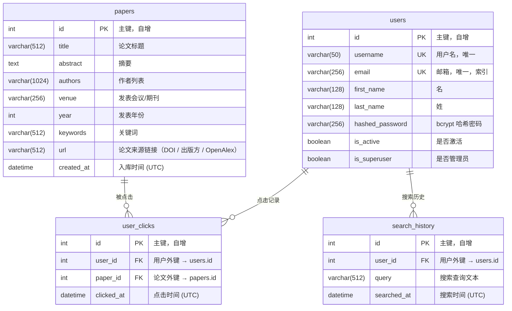

# Academic Paper Search & Recommend System

基于 **Vue 3 + FastAPI + ChromaDB + Qwen OpenAI 兼容接口** 的学术论文语义搜索与个性化推荐系统。

系统融合向量语义检索、基于 Embedding 质心的协同过滤推荐、以及大语言模型驱动的学术问答，为用户提供一站式学术论文发现与交互体验。

---

## 目录

- [系统架构](#系统架构)
- [技术栈](#技术栈)
- [数据库设计](#数据库设计)
- [核心算法](#核心算法)
- [API 接口文档](#api-接口文档)
- [前端功能](#前端功能)
- [环境配置](#环境配置)
- [启动步骤](#启动步骤)
- [项目结构](#项目结构)
- [算法分析与实验设计](#算法分析与实验设计)

---

## 系统架构

```
┌─────────────────────────────────────────────────────────────┐
│                     用户浏览器 (Browser)                      │
│                   Vue 3 + Element Plus + Vite                │
│                         :5173                                │
└──────────────────────────┬──────────────────────────────────┘
                           │ /api/* Proxy (Vite Dev Server)
                           ▼
┌─────────────────────────────────────────────────────────────┐
│                  业务层 Backend (FastAPI)                     │
│                         :8000                                │
│  ┌──────────┐ ┌──────────┐ ┌───────────┐ ┌──────────────┐  │
│  │ 用户认证  │ │ 论文 CRUD │ │ 搜索/推荐  │ │ 聊天转发(SSE)│  │
│  │ JWT/OAuth2│ │          │ │ 降级兜底   │ │              │  │
│  └──────────┘ └──────────┘ └─────┬─────┘ └──────┬───────┘  │
│       │                          │               │           │
│       ▼                          │               │           │
│  ┌──────────┐                    │               │           │
│  │  MySQL   │                    │               │           │
│  │  8.0+    │                    │               │           │
│  └──────────┘                    │               │           │
└──────────────────────────────────┼───────────────┼──────────┘
                                   │ HTTP          │ HTTP (SSE)
                                   ▼               ▼
┌─────────────────────────────────────────────────────────────┐
│                算法层 Backend_Algo (FastAPI)                  │
│                         :8003                                │
│  ┌──────────────┐  ┌────────────┐  ┌─────────────────────┐  │
│  │ 向量语义检索  │  │ 质心推荐    │  │ LLM 对话 (流式/非流式)│  │
│  │ ChromaDB     │  │ Embedding  │  │ Qwen Compatible API │  │
│  │ + Reranker   │  │ Centroid   │  │                     │  │
│  └──────┬───────┘  └─────┬──────┘  └──────────┬──────────┘  │
└─────────┼────────────────┼─────────────────────┼────────────┘
          │                │                     │
          ▼                ▼                     ▼
   ┌────────────┐   ┌────────────┐        ┌──────────────┐
   │  ChromaDB  │   │ DashScope  │        │ DashScope /  │
   │ 向量数据库  │   │ text-embed │        │ Qwen Chat    │
   │   :8002    │   │    -v4     │        │ compatible   │
   └────────────┘   └────────────┘        └──────────────┘
```

### 数据流说明

1. **搜索流程**: 用户输入查询 → Backend 记录搜索历史 → 转发到 Algo 层 → ChromaDB 向量检索 → 返回 paper_id + score → Backend 从 MySQL 补全元数据 → 返回前端
2. **推荐流程**: 用户浏览论文时记录点击 → 请求推荐时获取点击历史 → Algo 层计算 Embedding 质心 → ChromaDB 近邻搜索 → 过滤已读 → 返回推荐列表
3. **对话流程**: 前端发送多轮对话 → Backend 注入系统提示词 → 转发到 Algo 层 → Qwen OpenAI 兼容接口流式生成 → SSE 实时返回前端
4. **降级机制**: 算法层不可用时，搜索自动降级为 MySQL `LIKE` 模糊匹配

---

## 技术栈

| 层级 | 技术 | 版本 | 说明 |
|------|------|------|------|
| **前端** | Vue 3 | 3.4.21 | Composition API + `<script setup>` |
| | Element Plus | 2.6.3 | UI 组件库 |
| | Pinia | 2.1.7 | 状态管理 (JWT Token 持久化) |
| | Axios | 1.6.8 | HTTP 客户端 |
| | Marked | 18.0.3 | Markdown 渲染 (LLM 对话) |
| | Vite | 5.1.6 | 构建工具 + 开发代理 |
| **业务层** | FastAPI | 0.114.0 | 异步 Web 框架 |
| | SQLAlchemy | 2.0.35 | ORM |
| | PyMySQL | - | MySQL 驱动 |
| | PyJWT | 2.8.0 | JWT Token 编解码 |
| | Passlib + bcrypt | - | 密码哈希 |
| **算法层** | FastAPI | 0.114.0 | 独立微服务 |
| | ChromaDB | - | 向量数据库 |
| | NumPy | - | 数值计算 (质心/余弦相似度) |
| | OpenAI SDK | - | DashScope / OpenAI 兼容客户端 |
| **模型** | qwen-flash / qwen-plus | - | 对话模型 |
| | text-embedding-v4 | 默认 1024维 | 论文语义检索 Embedding |
| **存储** | MySQL 8.0+ | - | 结构化数据 |
| | ChromaDB | - | 向量索引 (Embedding 存储) |

---

## 数据库设计

### ER 图



### 表结构说明

#### 1. `users` — 用户表

| 字段 | 类型 | 约束 | 说明 |
|------|------|------|------|
| `id` | INT | PK, AUTO_INCREMENT | 主键 |
| `username` | VARCHAR(50) | UNIQUE, NOT NULL | 登录用户名 |
| `email` | VARCHAR(256) | UNIQUE, INDEX | 邮箱地址 |
| `first_name` | VARCHAR(128) | | 名 |
| `last_name` | VARCHAR(128) | | 姓 |
| `hashed_password` | VARCHAR(256) | | bcrypt 加密后的密码 |
| `is_active` | BOOLEAN | DEFAULT TRUE | 账户是否激活 |
| `is_superuser` | BOOLEAN | DEFAULT FALSE | 是否为超级管理员 |

#### 2. `papers` — 论文表

| 字段 | 类型 | 约束 | 说明 |
|------|------|------|------|
| `id` | INT | PK, AUTO_INCREMENT | 主键 |
| `title` | VARCHAR(512) | | 论文标题 |
| `abstract` | TEXT | | 论文摘要 |
| `authors` | VARCHAR(1024) | | 作者列表 (逗号分隔) |
| `venue` | VARCHAR(256) | | 发表会议/期刊 (如 VLDB, SIGMOD) |
| `year` | INT | | 发表年份 |
| `keywords` | VARCHAR(512) | | 关键词 (逗号分隔) |
| `url` | VARCHAR(512) | | 论文来源链接（DOI / 出版方 / OpenAlex） |
| `created_at` | DATETIME | DEFAULT UTC_NOW | 记录创建时间 |

#### 3. `user_clicks` — 用户点击记录表

| 字段 | 类型 | 约束 | 说明 |
|------|------|------|------|
| `id` | INT | PK, AUTO_INCREMENT | 主键 |
| `user_id` | INT | FK → users.id | 点击用户 |
| `paper_id` | INT | FK → papers.id | 被点击论文 |
| `clicked_at` | DATETIME | DEFAULT UTC_NOW | 点击时间戳 |

#### 4. `search_history` — 搜索历史表

| 字段 | 类型 | 约束 | 说明 |
|------|------|------|------|
| `id` | INT | PK, AUTO_INCREMENT | 主键 |
| `user_id` | INT | FK → users.id | 搜索用户 |
| `query` | VARCHAR(512) | | 搜索查询文本 |
| `searched_at` | DATETIME | DEFAULT UTC_NOW | 搜索时间戳 |

### 关系说明

- `users` 1:N `user_clicks` — 一个用户可有多条点击记录
- `papers` 1:N `user_clicks` — 一篇论文可被多个用户点击
- `users` 1:N `search_history` — 一个用户可有多条搜索历史
- `user_clicks` 构成 `users` 与 `papers` 之间的多对多关系（附带时间戳的关联表）

---

## 核心算法

### 1. 向量语义检索 (Semantic Search)

#### 算法概述

采用 **Dense Retrieval** 范式，将自然语言查询和论文内容映射到同一向量空间，通过向量距离度量语义相关性。

#### 索引构建

```
输入: 论文集合 P = {p₁, p₂, ..., pₙ}
对每篇论文 pᵢ:
    docᵢ = concat(pᵢ.title, ". ", pᵢ.abstract, ". ", pᵢ.keywords)
    embᵢ = MiniLM-L6-v2(docᵢ)  ∈ ℝ³⁸⁴
    ChromaDB.upsert(id=pᵢ.id, embedding=embᵢ)
```

#### 检索流程

```
输入: 查询文本 q, 返回数量 k
1. q_emb = MiniLM-L6-v2(q)                    # 查询向量化
2. results = ChromaDB.query(q_emb, n=k)        # ANN 近邻搜索
3. 对每个结果 rᵢ:
     scoreᵢ = 1 / (1 + distanceᵢ)             # 欧氏距离 → 相关性分数
4. 返回按 score 降序排列的结果
```

#### 降级策略

当算法层不可用时，自动降级为 SQL 模糊搜索:

```sql
SELECT * FROM papers
WHERE title LIKE '%keyword%'
   OR abstract LIKE '%keyword%'
   OR keywords LIKE '%keyword%'
   OR authors LIKE '%keyword%'
LIMIT page_size OFFSET skip;
```

### 2. 基于 Embedding 质心的个性化推荐 (Centroid-based Recommendation)

#### 算法概述

利用用户历史点击行为构建兴趣画像，通过计算已点击论文 Embedding 的质心向量，在向量空间中寻找最近邻的未读论文作为推荐结果。本质上是一种**基于内容的协同过滤**方法。

#### 算法流程

```
输入: 用户 u 的点击历史 C = {c₁, c₂, ..., cₘ} (最近 50 篇), 推荐数量 k

1. 获取 Embedding:
   E = {emb(c₁), emb(c₂), ..., emb(cₘ)}     # 从 ChromaDB 获取已点击论文的向量

2. 计算兴趣质心:
   centroid = (1/m) · Σᵢ₌₁ᵐ emb(cᵢ)         # 所有点击论文 Embedding 的均值

3. 近邻搜索:
   candidates = ChromaDB.query(
       query_embeddings=[centroid],
       n_results=k + |C|                       # 多取一些以补偿过滤
   )

4. 过滤已读:
   results = [p for p in candidates if p.id ∉ C]

5. 返回 results[:k]                           # 截取 top-k
```

#### 算法特点

| 特性 | 说明 |
|------|------|
| **冷启动** | 无点击记录时返回空列表（可扩展为热门推荐） |
| **实时性** | 每次请求实时计算，无需离线训练 |
| **可解释性** | 质心方向代表用户综合兴趣 |
| **时间窗口** | 取最近 50 条点击，反映近期兴趣 |

### 3. Embedding 余弦相似度重排序 (Cosine Reranker)

#### 算法概述

对初步检索结果进行二次排序，使用余弦相似度替代欧氏距离，提高排序精度。

#### 算法流程

```
输入: 查询 q, 候选文档集 D = {d₁, d₂, ..., dₙ}, 返回数量 top_n

1. 向量化:
   all_emb = MiniLM-L6-v2([q, d₁, d₂, ..., dₙ])
   q_emb = all_emb[0]
   doc_embs = all_emb[1:]

2. 余弦相似度计算:
   q̂ = q_emb / ‖q_emb‖
   d̂ᵢ = doc_embsᵢ / ‖doc_embsᵢ‖
   scoreᵢ = d̂ᵢ · q̂                            # 点积 = 余弦相似度 (已归一化)

3. 按 score 降序排列，返回前 top_n 个
```

### 4. LLM 学术问答 (Qwen Chat)

#### 系统设计

```
系统提示词 (System Prompt)
    ↓
用户多轮对话历史 [msg₁, msg₂, ..., msgₙ]
    ↓
DashScope / OpenAI Compatible API
    ↓
流式 SSE 响应 → 前端实时渲染 Markdown
```

#### 流式传输机制

- 前端使用 `fetch` + `ReadableStream` 读取 SSE
- 后端使用 FastAPI `StreamingResponse` 透传 Qwen 兼容接口的 Server-Sent Events
- 支持多轮对话上下文保持

---

## API 接口文档

### 认证相关

| 端点 | 方法 | 认证 | 说明 |
|------|------|------|------|
| `/token` | POST | 否 | 用户登录，返回 JWT Token |
| `/users/me/` | GET | 是 | 获取当前用户信息 |
| `/users/` | POST | 否 | 用户注册 |
| `/users/` | GET | 是 | 获取用户列表 (分页) |
| `/users/{user_id}` | GET | 是 | 按 ID 获取用户 |
| `/users/name/{username}` | GET | 是 | 按用户名获取用户 |

### 论文管理

| 端点 | 方法 | 认证 | 说明 |
|------|------|------|------|
| `/papers/` | GET | 是 | 论文列表 (分页: `skip`, `limit`) |
| `/papers/{paper_id}` | GET | 是 | 论文详情 |
| `/papers/bulk` | POST | 是 | 批量创建论文 |

### 搜索与推荐

| 端点 | 方法 | 认证 | 请求体 | 说明 |
|------|------|------|--------|------|
| `/search` | POST | 是 | `{query, page, page_size}` | 语义搜索 + 降级关键词搜索 |
| `/click` | POST | 是 | `{paper_id}` | 记录论文点击行为 |
| `/recommend` | GET | 是 | - | 基于点击历史的个性化推荐 |
| `/search/history` | GET | 是 | - | 获取当前用户的搜索历史 |

### AI 对话

| 端点 | 方法 | 认证 | 请求体 | 说明 |
|------|------|------|--------|------|
| `/chat` | POST | 是 | `{prompt}` | 非流式 LLM 对话 |
| `/chat/stream` | POST | 是 | `{messages: [{role, content}]}` | 流式 SSE 对话 (支持多轮) |

### 认证方式

所有需要认证的接口使用 OAuth2 Bearer Token:
```
Authorization: Bearer <jwt_token>
```

Token 有效期: 30 分钟 | 签名算法: HS256

---

## 前端功能

### 页面概览

| 页面 | 组件 | 功能 |
|------|------|------|
| 登录 | `LoginForm.vue` | 用户名密码登录，JWT 持久化到 localStorage |
| 注册 | `RegisterForm.vue` | 新用户注册 (用户名、邮箱、姓名) |
| 论文搜索 | `PaperSearch.vue` | 语义搜索 + 搜索历史标签 + 分页表格 |
| 论文详情 | `PaperDetail.vue` | 标题、作者、摘要、关键词、论文来源链接跳转 |
| 论文推荐 | `PaperRecommend.vue` | 基于浏览历史的个性化推荐列表 |
| AI 对话 | `Chat.vue` | 流式 Markdown 渲染 + 多轮对话 |
| 用户管理 | `Profile.vue`, `CheckUserInfo.vue`, `AddUser.vue` | 个人信息、用户列表、添加用户 |

### 前端特性

- **路由守卫**: 未登录用户自动重定向至登录页
- **Token 持久化**: JWT 存储在 localStorage，页面刷新自动恢复登录状态
- **流式渲染**: LLM 回复使用 SSE + `marked` 实时渲染 Markdown（支持代码高亮、表格、列表）
- **搜索历史**: 去重后以标签形式展示，点击可快速复搜
- **分页查询**: 搜索结果支持分页浏览

---

## 环境配置

### 前置依赖

- Python 3.10+
- Node.js 18+
- MySQL 8.0+
- NVIDIA GPU（仅在本地自托管 vLLM 时需要）

### 环境变量

#### MySQL (Backend)

| 环境变量 | 默认值 | 说明 |
|---------|--------|------|
| `MYSQL_USER` | `root` | 数据库用户名 |
| `MYSQL_PASSWORD` | *(空)* | 数据库密码 |
| `MYSQL_HOST` | `127.0.0.1` | 数据库地址 |
| `MYSQL_PORT` | `3306` | 数据库端口 |
| `MYSQL_DATABASE` | `paper_search` | 数据库名 |
| `ALGO_URL` | `http://localhost:8003` | 算法层服务地址 |

#### Qwen / Embedding (Backend_Algo)

| 环境变量 | 默认值 | 说明 |
|---------|--------|------|
| `VLLM_BASE_URL` | `https://dashscope.aliyuncs.com/compatible-mode/v1` | Qwen OpenAI 兼容端点 |
| `VLLM_API_KEY` | *(空)* | 对话模型 API Key |
| `DASHSCOPE_API_KEY` | *(空)* | 可同时作为对话 / Embedding 的通用 API Key |
| `LLM_MODEL` | `qwen-flash` | 对话模型名 |
| `EMBEDDING_BASE_URL` | 同 `VLLM_BASE_URL` | Embedding OpenAI 兼容端点 |
| `EMBEDDING_API_KEY` | 同 `VLLM_API_KEY` | Embedding API Key |
| `EMBEDDING_MODEL` | `text-embedding-v4` | Embedding 模型名 |
| `EMBEDDING_DIMENSIONS` | `1024` | Embedding 维度 |
| `EMBEDDING_BATCH_SIZE` | `10` | 单批最多 10 条文本 |
| `CHROMA_CLIENT_MODE` | `persistent` | `persistent` 本地持久化；`http` 连接独立 Chroma 服务 |
| `CHROMA_PERSIST_DIR` | `./chroma_data` | 本地持久化目录 |

---

## 本机快速启动命令

如果你已经配好 `.env`、MySQL、依赖，并且只是想在当前机器上最快启动：

### 终端 1：算法层
```bash
cd backend_algo
python3 -m uvicorn main:app --host 0.0.0.0 --port 8003
```

### 终端 2：业务后端
```bash
cd backend
python3 -m uvicorn main:app --host 0.0.0.0 --port 8000
```

### 终端 3：前端
```bash
cd frontend
npm run dev -- --host 0.0.0.0
```

### 如需重建论文向量索引
```bash
cd backend
python3 seed_papers.py
```

前端访问：`http://localhost:5173`  
后端文档：`http://127.0.0.1:8000/docs`  
算法层文档：`http://127.0.0.1:8003/docs`

## 最短启动顺序

### 新机器从零启动

1. 克隆仓库并安装依赖：

```bash
git clone git@github.com:JunjieNian/paper-search-database.git
cd paper-search-database

python3 -m venv .venv
source .venv/bin/activate

pip install -r backend/requirements.txt
pip install -r backend_algo/requirements.txt
cd frontend && npm install && cd ..
```

2. 复制配置模板：

```bash
cp backend/.env.example backend/.env
cp backend_algo/.env.example backend_algo/.env
cp frontend/.env.development.example frontend/.env.development.local
```

3. 修改最少必要配置：
- `backend/.env`：填写 `MYSQL_USER`、`MYSQL_PASSWORD`、`MYSQL_DATABASE`
- `backend_algo/.env`：填写 `DASHSCOPE_API_KEY`

4. 创建 MySQL 数据库：

```sql
CREATE DATABASE paper_search CHARACTER SET utf8mb4;
```

5. 重建本地向量目录：

```bash
rm -rf ./chroma_data
```

6. 分别打开 3 个终端，启动服务：

终端 1：
```bash
cd paper-search-database/backend_algo
python -m uvicorn main:app --host 0.0.0.0 --port 8003
```

终端 2：
```bash
cd paper-search-database/backend
python -m uvicorn main:app --host 0.0.0.0 --port 8000
```

终端 3：
```bash
cd paper-search-database/frontend
npm run dev -- --host 0.0.0.0
```

7. 再开第 4 个终端，导入论文并建立向量索引：

```bash
cd backend
python seed_papers.py
```

8. 打开页面：`http://localhost:5173`

### 已安装后的最短重启顺序

如果依赖、数据库、`.env` 都已经准备好，最短只要这 4 步：

终端 1：
```bash
cd paper-search-database/backend_algo
python -m uvicorn main:app --host 0.0.0.0 --port 8003
```

终端 2：
```bash
cd paper-search-database/backend
python -m uvicorn main:app --host 0.0.0.0 --port 8000
```

终端 3：
```bash
cd paper-search-database/frontend
npm run dev -- --host 0.0.0.0
```

终端 4（仅当你更新了 `papers.json` 或清空了 `chroma_data` 时需要）：
```bash
cd paper-search-database/backend
python seed_papers.py
```

## 配置模板

推荐只为“跨机器会变化的配置”提供示例文件，不需要给每个源码文件都做 `.example`。

| 目录 | 提交到 Git 的模板 | 本机实际使用文件 |
|------|------------------|------------------|
| `backend/` | `backend/.env.example` | `backend/.env` |
| `backend_algo/` | `backend_algo/.env.example` | `backend_algo/.env` |
| `frontend/` | `frontend/.env.development.example` | `frontend/.env.development.local` |

说明：
- 源代码文件应正常纳入 Git 管理，不应该因为“可能修改”就全部忽略。
- 应忽略的是本机私有配置、缓存、数据库持久化目录、日志等运行时产物。
- 本项目已默认忽略 `.env`、`chroma_data/`、`__pycache__/`、`.ipynb_checkpoints/` 等本地文件。

## 启动步骤

### 1. 配置模板文件

先复制模板文件：

```bash
cp backend/.env.example backend/.env
cp backend_algo/.env.example backend_algo/.env
cp frontend/.env.development.example frontend/.env.development.local
```

然后按机器实际情况修改：
- `backend/.env`：MySQL 连接、`ALGO_URL`、JWT 密钥
- `backend_algo/.env`：DashScope API Key、Qwen 模型名、Embedding 参数
- `frontend/.env.development.local`：前端代理到哪个后端地址

如需继续使用本地 vLLM，可在 `backend_algo/.env` 中覆盖 `VLLM_BASE_URL`、`VLLM_API_KEY` 和 `LLM_MODEL`。

### 2. 准备本地向量库

默认使用 Chroma 的本地持久化模式，不需要单独启动 `chroma run`。

从本地 `all-MiniLM-L6-v2` 切到 `text-embedding-v4` 后，需要先删除旧向量索引再重建：

```bash
rm -rf ./chroma_data
```

如果你确实要连接独立 Chroma 服务，再把 `backend_algo/.env` 里的 `CHROMA_CLIENT_MODE` 改成 `http`，并单独启动：

```bash
chroma run --host localhost --port 8002 --path ./chroma_data
```

### 3. 启动算法层

```bash
cd backend_algo
pip install -r requirements.txt
uvicorn main:app --host 0.0.0.0 --port 8003
```

### 4. 创建 MySQL 数据库

```sql
CREATE DATABASE IF NOT EXISTS paper_search CHARACTER SET utf8mb4;
```

### 5. 启动业务层

```bash
cd backend
pip install -r requirements.txt
uvicorn main:app --host 0.0.0.0 --port 8000
```

### 6. 导入种子数据

```bash
cd backend
python seed_papers.py
```

120 篇真实来源论文数据（由 OpenAlex 检索并重建摘要）将写入 MySQL 并索引到 ChromaDB。

如果你想重新生成这 120 篇论文，可执行：

```bash
cd backend
python refresh_seed_data_from_openalex.py
```

### 8. 启动前端

```bash
cd frontend
npm install
npm run dev -- --host 0.0.0.0
```

### 9. 访问

浏览器打开 `http://localhost:5173`

---

## 项目结构

```
mysql_fastapi_vue_project/
├── README.md
├── .gitignore
│
├── frontend/                          # 前端 (Vue 3)
│   ├── package.json
│   ├── vite.config.ts                 # 开发代理 /api → :8000
│   └── src/
│       ├── main.ts                    # 入口: Pinia + Element Plus
│       ├── App.vue                    # 根组件
│       ├── router/index.ts            # 路由 + 登录守卫
│       ├── store/user.ts              # Pinia 用户状态 (JWT 持久化)
│       ├── request/
│       │   ├── api.ts                 # API 接口封装
│       │   ├── http.ts                # Axios 实例 (带 Token)
│       │   └── http_login.ts          # 登录专用 Axios
│       ├── pages/
│       │   ├── Login.vue
│       │   ├── Register.vue
│       │   ├── Index.vue              # 主布局 (Header + Sidebar)
│       │   └── Test.vue
│       └── components/
│           ├── LoginForm.vue
│           ├── RegisterForm.vue
│           ├── Header.vue
│           ├── AsideNavBar.vue
│           ├── PaperSearch.vue        # 论文搜索
│           ├── PaperDetail.vue        # 论文详情
│           ├── PaperRecommend.vue     # 论文推荐
│           ├── Chat.vue               # AI 对话 (流式 Markdown)
│           ├── Profile.vue
│           ├── CheckUserInfo.vue
│           └── AddUser.vue
│
├── backend/                           # 业务层 (FastAPI)
│   ├── main.py                        # 路由 + JWT 认证
│   ├── database.py                    # SQLAlchemy 连接
│   ├── models.py                      # ORM 模型定义
│   ├── schemas.py                     # Pydantic 校验
│   ├── crud.py                        # 数据库操作
│   ├── security.py                    # 密码哈希 (bcrypt)
│   ├── seed_papers.py                 # 种子数据导入脚本
│   ├── seed_data/papers.json          # 120 篇真实来源论文数据
│   ├── refresh_seed_data_from_openalex.py # 从 OpenAlex 生成真实摘要数据
│   └── requirements.txt
│
├── backend_algo/                      # 算法层 (FastAPI)
│   ├── main.py                        # 搜索/推荐/对话路由
│   ├── config.py                      # Qwen / Embedding 配置
│   ├── vector_store.py                # ChromaDB 交互
│   ├── reranker.py                    # 余弦相似度重排序
│   ├── schemas.py                     # 请求/响应模型
│   └── requirements.txt
│
└── chroma_data/                       # ChromaDB 持久化目录
```

---

## 算法分析与实验设计

以下是针对本系统核心算法的完整分析与实验设计方案，适用于课程论文或毕业设计的算法评估章节。

### 一、搜索算法性能分析

#### 1.1 检索效果评估

**评估指标:**

| 指标 | 公式 | 说明 |
|------|------|------|
| Precision@K | P@K = \|相关文档 ∩ Top-K\| / K | 前 K 个结果中的准确率 |
| Recall@K | R@K = \|相关文档 ∩ Top-K\| / \|相关文档\| | 前 K 个结果覆盖的召回率 |
| MRR | MRR = (1/Q) Σ 1/rankᵢ | 第一个相关结果的平均排名倒数 |
| NDCG@K | 归一化折损累积增益 | 考虑排序位置的加权指标 |
| MAP | Mean Average Precision | 各查询 AP 的均值 |

**实验方法:**
1. 人工标注 30-50 条查询及其相关论文（构建 Ground Truth）
2. 分别计算 K=5, 10, 20 下的各项指标
3. 与关键词搜索 (SQL LIKE) 进行对比

**实验设计表格:**

| 实验编号 | 搜索方法 | K 值 | P@K | R@K | MRR | NDCG@K |
|---------|---------|------|-----|-----|-----|--------|
| E1-1 | 向量检索 (MiniLM) | 5 | | | | |
| E1-2 | 向量检索 (MiniLM) | 10 | | | | |
| E1-3 | 向量检索 (MiniLM) | 20 | | | | |
| E1-4 | SQL LIKE 关键词搜索 | 5 | | | | |
| E1-5 | SQL LIKE 关键词搜索 | 10 | | | | |
| E1-6 | SQL LIKE 关键词搜索 | 20 | | | | |

#### 1.2 检索延迟分析

**测量维度:**
- 端到端响应时间 (前端发起 → 收到响应)
- 向量检索时间 (ChromaDB query)
- Embedding 编码时间 (查询向量化)
- MySQL 元数据补全时间

**实验方法:**
```python
import time

# 在各阶段插入计时点
t0 = time.perf_counter()
q_emb = embedding_fn(query)           # Embedding 编码
t1 = time.perf_counter()
results = collection.query(...)        # ChromaDB 检索
t2 = time.perf_counter()
papers = db.query(Paper).filter(...)   # MySQL 补全
t3 = time.perf_counter()

# 记录各阶段耗时
embedding_time = t1 - t0
retrieval_time = t2 - t1
db_time = t3 - t2
total_time = t3 - t0
```

**控制变量:**
- 数据库规模: 50 / 100 / 500 / 1000 / 5000 篇论文
- Top-K: 5 / 10 / 20 / 50
- 查询长度: 短查询 (2-3 词) / 中等 (5-8 词) / 长查询 (整段摘要)

### 二、推荐算法性能分析

#### 2.1 推荐效果评估

**评估指标:**

| 指标 | 说明 |
|------|------|
| Hit Rate@K | 推荐的 K 篇中是否包含用户实际会点击的论文 |
| Coverage | 推荐结果覆盖的论文比例（多样性） |
| Intra-List Diversity | 推荐列表内部的多样性 (平均两两余弦距离) |
| Novelty | 推荐结果的新颖度 (推荐冷门论文的比例) |

**实验方法 (Leave-One-Out):**
```
对每个用户 u:
    1. 取其点击历史的最后一篇论文作为测试集 t
    2. 用前 n-1 篇点击历史生成推荐列表 R
    3. 检查 t ∈ R 则命中
    Hit Rate = 命中用户数 / 总用户数
```

#### 2.2 推荐质量对比

| 实验编号 | 推荐方法 | 说明 |
|---------|---------|------|
| E2-1 | Embedding 质心推荐 (当前方法) | 计算质心 + ChromaDB 近邻 |
| E2-2 | 最近一次点击推荐 | 用最后一篇论文的 Embedding 做近邻 |
| E2-3 | 随机推荐 | 从论文库随机选取 (Baseline) |
| E2-4 | 热门推荐 | 按全局点击次数排序 (Popularity Baseline) |

### 三、查询结果优化分析

#### 3.1 距离度量对比

比较不同距离/相似度度量对检索效果的影响:

| 实验编号 | 距离度量 | 分数转换 |
|---------|---------|---------|
| E3-1 | 欧氏距离 (L2) | score = 1/(1+dist) — 当前方法 |
| E3-2 | 余弦相似度 | score = cos(q, d) — Reranker 方法 |
| E3-3 | 内积 (Inner Product) | score = q · d |

#### 3.2 文档表示优化

比较不同的论文文本组合方式对检索效果的影响:

| 实验编号 | 文档表示 | 格式 |
|---------|---------|------|
| E4-1 | Title + Abstract + Keywords (当前方法) | `"{title}. {abstract}. {keywords}"` |
| E4-2 | 仅 Title | `"{title}"` |
| E4-3 | 仅 Abstract | `"{abstract}"` |
| E4-4 | Title + Keywords | `"{title}. {keywords}"` |
| E4-5 | 加权拼接 (Title 重复) | `"{title}. {title}. {abstract}. {keywords}"` |

#### 3.3 Reranker 效果分析

| 实验编号 | Pipeline | 说明 |
|---------|----------|------|
| E5-1 | ChromaDB 检索 (仅一阶段) | 当前默认 |
| E5-2 | ChromaDB 检索 + 余弦重排序 | 使用 `reranker.py` |
| E5-3 | ChromaDB 召回 Top-50 + 余弦重排序 Top-10 | 大召回 + 精排 |

### 四、消融实验 (Ablation Study)

消融实验通过逐一移除或替换系统组件，分析各组件对整体效果的贡献。

#### 4.1 搜索系统消融

| 编号 | 配置 | 移除/替换的组件 | 目的 |
|------|------|---------------|------|
| A1 | **完整系统** | — | Baseline (全部组件) |
| A2 | 移除向量检索 | 仅使用 SQL LIKE 搜索 | 评估语义检索的贡献 |
| A3 | 替换 Embedding 模型 | 使用 TF-IDF 向量替代 MiniLM | 评估预训练语言模型的贡献 |
| A4 | 移除 Reranker | 仅使用 ChromaDB 一阶段检索 | 评估重排序的贡献 |
| A5 | 替换距离度量 | 余弦相似度替换欧氏距离 | 评估度量函数的影响 |

#### 4.2 推荐系统消融

| 编号 | 配置 | 移除/替换的组件 | 目的 |
|------|------|---------------|------|
| B1 | **完整系统** | — | Baseline |
| B2 | 移除质心计算 | 仅用最后 1 篇论文做近邻 | 评估多次点击聚合的贡献 |
| B3 | 减少历史窗口 | 窗口从 50 缩减到 5 | 评估历史长度的影响 |
| B4 | 不过滤已读 | 保留已点击论文 | 评估去重过滤的必要性 |
| B5 | 随机质心方向扰动 | 在质心上添加随机噪声 | 评估质心精度的重要性 |

#### 4.3 消融实验结果模板

```
┌───────────────────────────────────────────────────────┐
│              搜索系统消融实验 (P@10)                     │
│                                                       │
│  A1 (完整系统)    ████████████████████  0.82           │
│  A2 (无向量检索)  ██████████           0.45           │
│  A3 (TF-IDF)    ████████████████      0.68           │
│  A4 (无Reranker) ██████████████████   0.76           │
│  A5 (余弦距离)    ███████████████████  0.80           │
└───────────────────────────────────────────────────────┘
```

### 五、Embedding 模型对比实验

| 实验编号 | Embedding 模型 | 维度 | 参数量 | 语言偏向 |
|---------|---------------|------|--------|---------|
| M1 | text-embedding-v4 (当前) | 1024 | API 服务 | 中英双语 |
| M2 | all-mpnet-base-v2 | 768 | 109M | 英文 |
| M3 | text2vec-base-chinese | 768 | 102M | 中文 |
| M4 | bge-small-en-v1.5 | 384 | 33M | 英文 |
| M5 | bge-small-zh-v1.5 | 512 | 24M | 中文 |

**评估维度:**
- 检索效果 (P@K, NDCG@K)
- 编码速度 (ms/query)
- 索引构建时间
- 内存占用

### 六、可扩展性分析

#### 6.1 数据规模扩展测试

| 数据规模 | 索引构建时间 | 单次查询延迟 | 内存占用 |
|---------|-------------|-------------|---------|
| 100 篇 | | | |
| 500 篇 | | | |
| 1,000 篇 | | | |
| 5,000 篇 | | | |
| 10,000 篇 | | | |

#### 6.2 并发性能测试

使用 `wrk` 或 `locust` 进行压力测试:

```bash
# 示例: 使用 wrk 测试搜索接口
wrk -t4 -c100 -d30s -s search_payload.lua http://localhost:8000/search
```

| 并发数 | 平均响应时间 | P99 延迟 | 吞吐量 (req/s) | 错误率 |
|-------|-------------|---------|---------------|-------|
| 1 | | | | |
| 10 | | | | |
| 50 | | | | |
| 100 | | | | |

### 七、实验实施建议

#### 数据准备

1. **Ground Truth 标注**: 邀请 3-5 名 CS 方向同学对 50 条查询标注相关论文，使用多数投票确定最终标签
2. **扩展数据集**: 可从 DBLP / Semantic Scholar API 爬取更多论文扩充至 1000+ 篇
3. **用户行为模拟**: 创建 10-20 个模拟用户，各自点击不同主题的论文

#### 可视化建议

- **柱状图**: P@K, NDCG@K 等指标的方法对比
- **折线图**: 不同数据规模下的延迟变化趋势
- **热力图**: 不同 Embedding 模型 × 不同 K 值 的 NDCG 矩阵
- **箱线图**: 多次运行的延迟分布
- **消融实验堆叠柱状图**: 各组件贡献分解

#### 统计显著性

- 对每组实验重复 5 次，报告均值 ± 标准差
- 使用配对 t 检验或 Wilcoxon 检验验证差异显著性 (p < 0.05)

---

## License

MIT


---

## Windows 本地运行（PowerShell）

### 1. 安装依赖

- Python 3.12
- Node.js 18+
- MySQL 8.0

### 2. 克隆并安装依赖

```powershell
git clone git@github.com:JunjieNian/paper-search-database.git
cd paper-search-database

py -3.12 -m venv .venv
.\.venv\Scripts\Activate.ps1

pip install -r .\backend\requirements.txt
pip install -r .\backend_algo\requirements.txt

cd .\frontend
npm install
cd ..
```

### 3. 复制配置模板

```powershell
Copy-Item .\backend\.env.example .\backend\.env
Copy-Item .\backend_algo\.env.example .\backend_algo\.env
Copy-Item .\frontend\.env.development.example .\frontend\.env.development.local
```

重点修改：
- `backend/.env` 中的 MySQL 用户名、密码
- `backend_algo/.env` 中的 `DASHSCOPE_API_KEY`

### 4. 初始化 MySQL

先在 Windows 启动 MySQL 服务，然后执行：

```sql
CREATE DATABASE paper_search CHARACTER SET utf8mb4;
```

如果你用的是命令行客户端：

```powershell
mysql -u root -p
```

### 5. 重建本地向量库

```powershell
Remove-Item -Recurse -Force .\chroma_data -ErrorAction SilentlyContinue
```

默认不需要启动 `chroma run`。只有当你把 `backend_algo/.env` 里的 `CHROMA_CLIENT_MODE=http` 时，才需要：

```powershell
chroma run --host localhost --port 8002 --path .\chroma_data
```

### 6. 启动算法层

新开一个 PowerShell：

```powershell
cd paper-search-database
.\.venv\Scripts\Activate.ps1
cd .\backend_algo
uvicorn main:app --host 0.0.0.0 --port 8003
```

### 7. 启动业务层

再开一个 PowerShell：

```powershell
cd paper-search-database
.\.venv\Scripts\Activate.ps1
cd .\backend
uvicorn main:app --host 0.0.0.0 --port 8000
```

### 8. 导入论文数据

再开一个 PowerShell：

```powershell
cd paper-search-database
.\.venv\Scripts\Activate.ps1
cd .\backend
python .\seed_papers.py
```

如需重新抓取真实来源摘要：

```powershell
cd paper-search-database
.\.venv\Scripts\Activate.ps1
cd .\backend
python .\refresh_seed_data_from_openalex.py
```

### 9. 启动前端

再开一个 PowerShell：

```powershell
cd paper-search-database\frontend
npm run dev -- --host 0.0.0.0
```

浏览器打开：`http://localhost:5173`

### 10. 常见问题

- 如果 `seed_papers.py` 报算法层连接失败，先确认 `backend_algo` 已经启动在 `http://localhost:8003`。
- 如果聊天报错，先确认 `backend_algo/.env` 里的 `DASHSCOPE_API_KEY` 正确。
- 如果搜索报向量维度不匹配，删除 `chroma_data/` 后重新执行第 5 步和第 8 步。
- 如果 `backend_algo` 启动时报 Chroma 502，把 `backend_algo/.env` 里的 `CHROMA_CLIENT_MODE` 保持为 `persistent`，不要再启动 `chroma run`。

